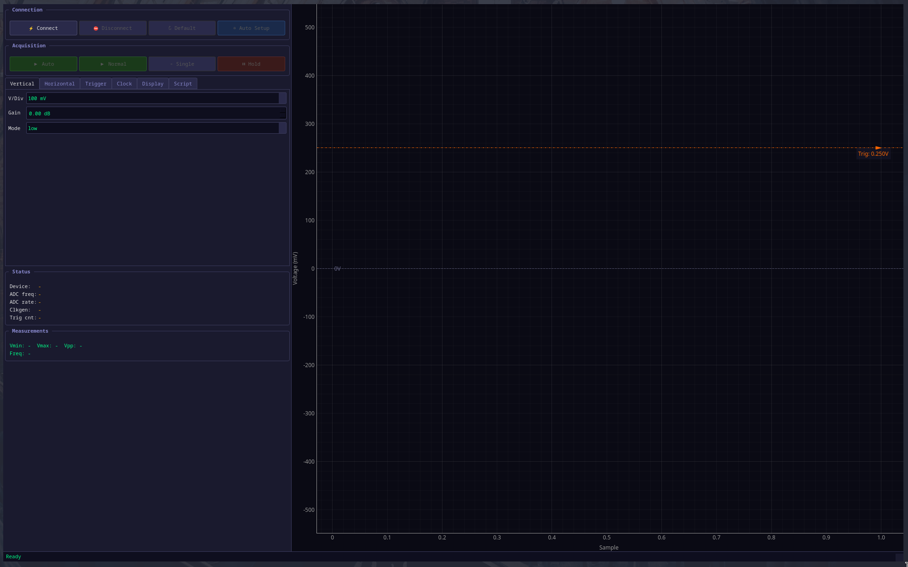

# CW-Scope

Oscilloscope GUI for ChipWhisperer devices (Husky and Lite). Provides real-time waveform visualization with full control over capture parameters.




## Features

- **Real-time waveform display** with phosphor-green trace on dark background
- **FFT spectrum analyzer** — toggle to see frequency-domain magnitude plot
- **Draggable trigger line** — set trigger level by dragging directly on the plot
- **Measurement cursors** — two vertical cursors with delta readout
- **Zero baseline** marker on waveform
- **Scope-style acquisition modes**: Auto, Normal, Single, Hold
- **Volts/Div and Time/Div** view scaling controls
- **Script tab** — shows current device parameters as copyable Python code
- **Device auto-detection** — supports both ChipWhisperer Husky and Lite with device-specific controls
- **Dark oscilloscope theme**

## Installation

```bash
pip install -r requirements.txt
```

Requirements:
- Python 3.8+
- ChipWhisperer hardware (Husky or Lite)

## Usage

```bash
python scope.py
```

1. Click **Connect** to detect and connect to your ChipWhisperer device
2. Select an acquisition mode:
   - **Auto** — continuous capture, shows trace even on trigger timeout
   - **Normal** — continuous capture, waits for trigger
   - **Single** — captures one trace and stops
   - **Hold** — freezes the display
3. Adjust settings in the tabbed control panel:
   - **Vertical** — Volts/Div, gain, gain mode
   - **Horizontal** — Time/Div, samples, offset, presamples, decimate, timeout
   - **Trigger** — module, edge/level mode, pin, ADC trigger level
   - **Clock** — source, frequency, ADC multiplier (Husky), ADC source (Lite), ADC bits (Husky)
   - **Display** — toggle cursors and FFT view
   - **Script** — view current parameters as Python code for use in scripts

## Scripting

The **Script** tab shows the current device configuration as Python code you can copy directly into your ChipWhisperer scripts:

```python
import chipwhisperer as cw
scope = cw.scope()

scope.gain.db = 25.0
scope.gain.mode = "low"
scope.adc.samples = 5000
scope.clock.clkgen_freq = 7370000.0
# ... etc
```

## Architecture

Single-file app (`scope.py`) with these components:

| Class | Role |
|-------|------|
| `ScopeConnection` | Wraps `cw.scope()` with thread-safe USB access |
| `CaptureWorker` | Runs capture loop in a dedicated QThread |
| `WaveformPlot` | pyqtgraph widget with trigger line, zero line, cursors |
| `FFTPlot` | pyqtgraph widget showing FFT magnitude spectrum |
| `ControlPanel` | Tabbed sidebar with all scope controls |
| `MainWindow` | Wires everything together |

All USB device access is serialized through `ScopeConnection.usb_lock`. The capture worker reads device status in its own thread and emits it alongside trace data, so the GUI thread never touches USB during capture.

## License

MIT
